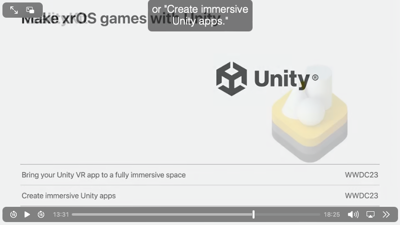

# Purpose

This proj is to compare the difference between Usdz and NeRF in cockpit HMI design.

# To do:
- is it possible to create an NeRF from series of image from youtube https://www.youtube.com/watch?v=6pa9-rul5aA

# 3D asset creation/import

## A route of USDA/USDC/USDZ
it is well known that usda/c/z format are supported in the apple ecosystem.
One of the process is proposed by https://github.com/Sigil-Wen/Dream-with-Vision-Pro?tab=readme-ov-file 
-- [Dream with Vision Pro](https://github.com/Sigil-Wen/Dream-with-Vision-Pro?tab=readme-ov-file)
a, user gives a word. The word triggers the [shape-E](https://github.com/openai/shap-e) , which is a text-conditioned model. This produces a .obj file - a standard 3D model format
b, scale: the app utilizes "Spellbook" and GPT-4 promping engineering to estimate the objs' hight and dimension. 
c. using [3D Viewer](https://3dviewer.net/#model=https://raw.githubusercontent.com/IFCjs/test-ifc-files/main/Others/haus.ifc) to convert .obj file into 3D model which the user could interact with.
## A route of NeRF

# Research
1. The basic of VisionOS https://developer.apple.com/documentation/visionos 
1.5 Rapidcompact is an app to provide 3d asset by convert typical 3D model into usdz https://www.rapidcompact.com/get-your-3d-scene-ready-for-apple-vision-pro/
2. A spectrum of immersion: shared space vs full space vs fully immersive. https://developer.apple.com/videos/play/wwdc2023/10096
3. System gestures includes look & tap, Drag, magnify etc.
4. Unity resource for the game app. This comes from Apple Full space app example "Happy BEAM" https://developer.apple.com/documentation/visionos/happybeam 

5. Nvidia Marco Pavone's team demonstrates that [EmerNeRF](https://github.com/NVlabs/EmerNeRF?tab=readme-ov-file#introduction) could levarge the single trip data of the multi sensor to reconstruct the 4-D driving scenece (3D space + temporal). The model achieves state-of-the art performance in sensor simulation according to the [paper](https://arxiv.org/pdf/2311.02077.pdf). PreTrain model may be available for the qualified users. 

# Vendors: I found interesting vendors as the following:
1. The IMC Lab (Interactive Multimedia Culture) https://theimclab.com
It provides XR/AR/MR app dev. Their website and github shows some of the research they are doing. 
2. [List of VisionPro apps](https://github.com/furnacecreek/awesome-visionOS-apps)
3. [Awesome-Vision-Pro](https://github.com/jtmuller5/Awesome-Vision-Pro?tab=readme-ov-file)
In my opinion, this repo is better than 'furnacecreek's awesome-visionOS-apps' even though it has less stars.
4. [sketchfab](https://sketchfab.com/tags/nerf)
5. [Polycam](https://poly.cam), [Luma AI]()
6. An influencer's website to track all research on NeRF and AI: [Radiance Fields](https://radiancefields.com/)

# Terms
- developer strap : a usb-c connection between VisionPro and Mac (https://developer.apple.com/visionos/resources/)
- Gaussian splattering
